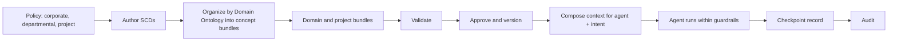
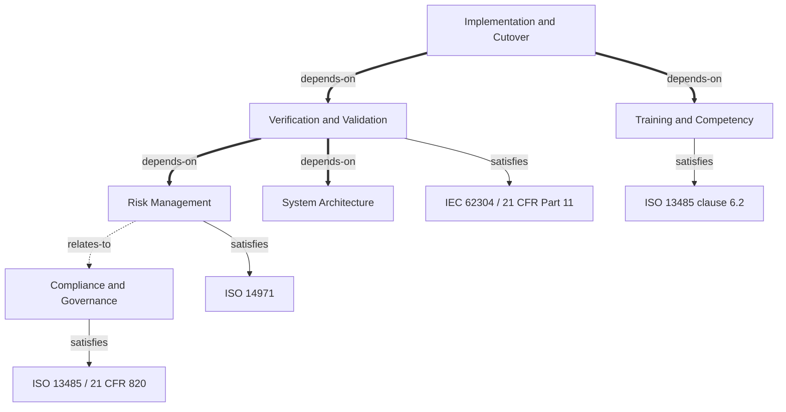

# SCS 0.5.0 — Presentation Deck

Slide content and speaker notes, ready to paste into PowerPoint. Working notes, accuracy checks and open
items live in `scs-0.5.0-story.md` and are deliberately left out of this file.

**Format:** each slide has the slide content (title, bullets, tables, code) followed by *Speaker notes*.

---

## Before presenting (checklist)

SCS 0.5 is still a draft, so these depend on work in flight. Recheck each right before presenting.

- [x] Tooling fixes verified 2026-09-24 (ISS-026, 027, 028 and related; rerun the demo script in `scs-0.5.0-story.md`); confirm they are committed and released
- [x] ISS-035 fixed (the validator wheel now works when installed); confirm the changes are committed
- [x] MCA ontology added to the repo (slide 2.8, 3.3)
- [ ] The client has cleared publishing the MCA ontology
- [ ] Packages published to PyPI (ISS-014), or say "from source" on slides 3.4 and 3.7
- [ ] `docs/MIGRATION-0.5.0.md` exists (slide 3.13)
- [ ] Concept counts on slide 2.8 still match the shipped ontologies
- [ ] Release status on slide 3.14 matches `RELEASE-0.5.0.md`
- [ ] structuredcontext.dev and the docs site do not show 0.3 content (slide 3.15)

---

## Slide 0.1 — SCS 0.5.0

**Structured Context Specification**

The governed context layer for any AI actor

Tim McCrimmon, Ohana Consulting LLC

> **Speaker notes:** Welcome. Three parts: what context is and why AI agents need it, how SCS is structured (with the Domain Ontology as the centerpiece), and how to use it. SCS 0.5 is still a draft, so I will describe it as a release in progress.

## Slide 0.2 — Agenda

1. Context: what it is and why SCS
2. SCS structure: the workflow, the components, and the Domain Ontology
3. How to use SCS 0.5.0

> **Speaker notes:** Section 1 is the problem. Section 2 is the model. Section 3 is practical.

---

## Section 1 — Context: What It Is and Why SCS

> **Speaker notes:** AI agents behave unpredictably without context. Here is what context is and the two kinds, why SCS focuses on one of them, and four reasons SCS exists.

---

## Slide 1.1 — Why AI Agents Behave Unpredictably

- Agents are given a task, not the rules of the organization they work for
- Where the rules are missing, the agent guesses
- The guesses are fluent and confident, so they are hard to spot
- Result: drift, invention (hallucination), and inconsistency from one run to the next

> **Speaker notes:**
> Key point: An agent with no boundaries fills every gap with a plausible guess.
>
> Ask two agents, or the same agent on two days, to do the same job and the answers can differ. The
> model is not misbehaving; it was never told where the edges are. Whatever the prompt does not settle,
> the agent settles for itself.
>
> Optional example: in `docs/quick-start-guide.md`, an agent asked for a Task model invents assignee, team and attachment fields that are out of scope. It is an illustration, not measured data, so present it as one.

---

## Slide 1.2 — What Is Context?

- Context = the limits, conventions and rules an agent works within
- Written for agents first; people benefit too (consistency, review, onboarding)
- Its job: keep the agent from drifting and from making things up

> **Speaker notes:**
> Key point: Context is what keeps an agent inside the lines. It exists mainly for the agent.
>
> We usually think of context as something for the user's convenience. The more useful view is that it
> is for the agent. It tells the agent what is allowed, what the house conventions are, and what it must
> not do. People benefit as a side effect, because the same rules are visible to them.

---

## Slide 1.3 — Two Kinds of Context

| | Guardrails | State data |
|---|---|---|
| What it is | Limits, conventions, rules, policies | Current facts: an order, a balance, a record |
| Applies to | All agents | Depends on the task |
| Changes | Rarely, and deliberately | Constantly |
| Comes from | Company leadership and policy | Systems of record |
| Delivered by | Present every time | Looked up when needed |

> **Speaker notes:**
> Key point: Guardrails and state data behave differently, so they are handled differently.
>
> Guardrails are the decisions an organization has made and expects every agent to honor. They change
> slowly and someone is accountable for them. State is the world as it is right now. It changes all the
> time, so it cannot be written down once; it has to be looked up.

---

## Slide 1.4 — Guardrails Reflect Policy

- Corporate policy
- Departmental policy
- Project-level rules
- Every agent in scope follows them, whatever task it is doing

> **Speaker notes:**
> Key point: Guardrails are the organization's policies, expressed for agents.
>
> Guardrails are not invented by the AI team. They restate what leadership, departments and project
> owners have already decided. That is why they are stable, and also why they do change from time to
> time when a policy changes.

---

## Slide 1.5 — SCS Focuses on Guardrail Context

- SCS: guardrail context - stable, authored, versioned, approved
- Not SCS: state data - looked up by tools, APIs and application code
- The two work together: guardrails bound what an agent may do with the state it retrieves

> **Speaker notes:**
> Key point: SCS governs guardrails. State is fetched at runtime by other means.
>
> The scope is deliberate. State data has a good home already: the tool calls and systems that hold it.
> What has been missing is a disciplined way to define, version and audit the guardrails. That is the
> gap SCS fills.

---

## Slide 1.6 — Why SCS? Four Reasons

1. Small - context is sent with every prompt, so size costs money
2. Clear - long-winded context confuses agents
3. Versioned - policies change, so you must know which version an agent used
4. Governable - regulators expect audit trails, provenance and transparency

> **Speaker notes:**
> Key point: Guardrails need to be small, clear, versioned and governable.
>
> These four reasons are the rest of the section. Each one is a problem you will recognize from
> context you have written by hand.

---

## Slide 1.7 — Small: Context Is Paid For Every Time

- Context is sent with every prompt
- Long-winded context gets expensive
- SCS keeps guardrails to the essential aspects: atomic documents, one idea each

> **Speaker notes:**
> Key point: Guardrails travel with every prompt, so every extra word is repeated cost.
>
> Take a rule written in 500 words when 50 would do. The extra 450 are paid on every call, for every agent,
> indefinitely. SCS is built around concise, atomic, structured documents so that what travels is
> what matters.

---

## Slide 1.8 — Clear: One Decision Per Document

- Long context tends to be: confusing, inconclusive, arbitrary, contradictory
- SCS: each SCD is one atomic, typed, versioned decision
- Explicit relationships between documents; structure checked by a validator

> **Speaker notes:**
> Key point: Long context is confusing, inconclusive, arbitrary and contradictory. Structure is the remedy.
>
> When rules accumulate in a long document, they start to overlap and disagree, and the agent has to
> pick one. Structure removes most of that: one decision per document, typed, and linked explicitly to
> the others it relates to.

---

## Slide 1.9 — Versioned: Know What Each Agent Followed

- Corporate, departmental and project policy each change over time
- SCS bundles are versioned, and approved once released
- Each agent's context can be traced to an exact version at any point in time

> **Speaker notes:**
> Key point: Policies change, so context is versioned and you can tell which version governed which agent.
>
> When an incident review asks "what rules was the agent working under on that day?", the answer should
> be a version number and an approver, not a guess.

---

## Slide 1.10 — Governable: Audit, Provenance, Transparency

- Audit trail: which context governed which step
- Provenance: who authored it, who approved it, when
- Transparency: guardrails are readable by people and by machines
- Regulatory mapping: concepts linked to the standards they satisfy

> **Speaker notes:**
> Key point: Regulated work needs evidence. SCS provides the structure for it.
>
> In regulated industries, "the agent followed our policy" is a claim that needs evidence. Authorship,
> approval, versions and checkpoints are that evidence. SCS makes the evidence possible to produce.

---

## Slide 1.11 — Bridge to Section 2

- Section 1 recap: context bounds agents; guardrails vs state; SCS = small, clear, versioned, governable
- Next: SCDs, bundles and the Domain Ontology

> **Speaker notes:**
> Key point: Next: how SCS structures guardrails.

---

## Section 2 — SCS Structure

> **Speaker notes:** We start with the workflow, then the components on it, then the Domain Ontology in depth, and finish with how guardrails reach an agent.

---

## Slide 2.1 — The SCS Workflow

**[Diagram: the SCS workflow, left to right]**

1. **Policy** - corporate, departmental and project policy (the source of guardrails)
2. **Author SCDs** - one atomic decision per document
3. **Organize by Domain Ontology** - each SCD belongs to a concept; concepts become concept bundles
4. **Assemble bundles** - concept bundles -> domain bundle -> project bundle
5. **Validate** - structure, references and ontology rules checked
6. **Approve and version** - a named approver and a version number
7. **Compose for the agent** - context selected by (agent, intent) and delivered
8. **Agent runs within the guardrails**
9. **Checkpoint record** - which bundle version governed this step
10. **Audit**

Diagram notes:
- Make step 3 (the ontology) visually the largest element; it is the emphasis of this section.
- Draw a boundary between what **SCS defines** (steps 1-6, plus the *shape* of the record in step 9)
  and what a **runtime performs** (steps 7-9: composing, running, writing the record). SCS does not
  compose, run or enforce; a runtime such as SCP does.
- Tag steps with the Section 1 reasons: 2 = small, 3 and 5 = clear, 6 = versioned, 9 and 10 = governable.

Reference sketch (Mermaid):



> **Speaker notes:**
> Key point: SCS carries a policy from written intent to an auditable agent run, in a defined sequence.
>
> Read the diagram left to right. The left half is authoring and governance: people decide, write, check
> and approve. The right half is runtime: an agent receives the right slice of that approved context and
> leaves a record of which version it followed. The middle is where the structure earns its keep.

---

## Slide 2.2 — The Components at a Glance

| # | Component | What it is | Serves |
|---|---|---|---|
| 1 | **SCD** | One atomic guardrail: a rule, constraint or decision, in YAML | Small |
| 2 | **Tier** | Meta (vocabulary), Standards (requirements), Project (the system) | Clear |
| 3 | **Bundle** | A versioned manifest that groups SCDs and other bundles | Versioned |
| 4 | **Domain Ontology** | The industry baseline: the concepts (categories) guardrails are organized around, and how they relate | Clear, Governable |
| 5 | **Validator** | Checks structure, references and ontology rules | Clear |
| 6 | **Approval + checkpoint** | Who approved a version; which version governed a step | Versioned, Governable |

> **Speaker notes:**
> Key point: Six components; the ontology is the one that organizes the rest.
>
> Five of these are things you would expect: a unit of content, a way to classify it, a way to package it,
> a way to check it, a way to sign it off. The fourth is the one that is new in 0.5.0 and the one that
> gives the rest a shape.

---

## Slide 2.3 — The SCD: One Guardrail, One Document

- One coherent piece of context per document: a rule, a constraint, a compliance requirement, a decision
- YAML: readable by people, parseable by machines
- Typed, versioned, independently reviewable, linkable to other SCDs
- Names itself: `scd:<tier>:<name>`

```yaml
id: scd:project:hazard-analysis-procedure
type: project
title: Hazard Analysis Procedure
version: "0.5.0"
concept: concept:risk-management
content:
  ...
```
*(from `spec/0.5/domain-ontology.md` §3.3; shows the new optional `concept` field that links an SCD to
the ontology)*

> **Speaker notes:**
> Key point: The Structured Context Document is the atomic unit.
>
> Small on purpose. If a document is describing two things, it should be two documents. That is what keeps
> context small and what makes each guardrail reviewable and replaceable on its own.

---

## Slide 2.4 — Three Tiers

- **Meta** - the shared language: roles, capabilities, naming, system-wide intent
- **Standards** - external requirements as importable contracts: HIPAA, SOC2, ISO 13485, IEC 62304
- **Project** - the actual system: architecture, requirements, workflows, policies
- Standards are imported, not rewritten for each project

> **Speaker notes:**
> Key point: SCDs fall into three tiers so vocabulary, requirements and the system stay separate.
>
> Meta defines the words. Standards holds requirements someone else already wrote. Project holds what is
> specific to this system. Keeping them apart means a standard can be updated once and imported many times.

---

## Slide 2.5 — Bundles and the Hierarchy

- A bundle is a versioned manifest, not an SCD (think Docker manifest)
- **Concept bundle** - the SCDs realizing one concept; a leaf, imports nothing
- **Domain bundle** - imports the concept bundles for an industry or practice area
- **Project bundle** - imports what one initiative needs
- Meta and Standards bundles carry the vocabulary and the requirements

> **Speaker notes:**
> Key point: Bundles package SCDs into a hierarchy: Project > Domain > Concept > SCD.
>
> This is the packaging that makes context reusable and versionable. A project does not copy the domain's
> guardrails; it imports them at a pinned version.

---

## Slide 2.6 — The Domain Ontology: What Organizes the Guardrails

- Every domain has a set of things its guardrails are about: risk, validation, suppliers, security...
- 0.3 called this a flat list of "concerns"; it was really one industry's list (software development)
- A medical-device CDMO needed risk management, design controls and supplier qualification, and lost
  the regulatory mapping that matters most in that market
- 0.5.0 makes the model explicit: the **Domain Ontology**, which reflects the industry the customer is in

> **Speaker notes:**
> Key point: A domain needs a shared model of what matters in its work. That model is the ontology.
>
> The question a regulated team actually asks is "does our context cover this clause of this standard?"
> A flat list of headings cannot answer that. A model of concepts, how they relate, and which standards
> they address can.

---

## Slide 2.7 — The Ontology Has Three Parts

1. **Concepts** - named categories of domain knowledge (`concept:risk-management`). Replaces "concerns"
2. **Taxonomy** - optional parent and child (`concept:iso-14971-risk-analysis` under risk management)
3. **Relationships** - `depends-on`, `relates-to`, `satisfies`
- `satisfies` links a concept to the standards it exists to address
- Depth is optional: the smallest valid ontology is a flat list of concepts
- Not OWL, not RDF, no reasoner: a typed graph you can read

> **Speaker notes:**
> Key point: Concepts, an optional taxonomy, and a small fixed set of relationships.
>
> Start with a flat list and add structure as the domain matures. The relationship set is deliberately
> small: three edge types, so anyone can read and review it.

---

## Slide 2.8 — Three Ontologies for Three Industries

| Industry | Ontology | Concepts | What is distinctive |
|---|---|---|---|
| Software development | **SDLC** | 11 | Architecture, security, testing and validation, deployment and operations |
| Medical-device CDMO | **CDMO** | 12 | Risk management, verification and validation, supplier qualification, QMS records; concepts mapped to regulatory standards |
| Merchant cash advance (business funding) | **MCA** | 16 | Origination, underwriting and decisioning, contract characterization, disclosure compliance, servicing and collections |

- Same job in every industry: define the categories of guardrail that matter
- Different categories, because different industries have different things to get right
- Adoption starts by choosing the ontology for your industry, not by writing one

> **Speaker notes:**
> Key point: The ontology reflects the industry the customer is in.
>
> A software company and a lender do not worry about the same things. Trying to run both through one
> list of headings loses what matters most in each. So SCS has one ontology per industry. Each is a
> baseline: the categories an organization in that industry needs guardrails for.
>
> Also worth saying: the same word can mean different things by industry. In MCA "security" natively means the lien on receivables, so the MCA ontology names its access-control concept `data-security` instead. Good evidence for why one shared list does not work.

---

## Slide 2.9 — Ontology, Concepts, SCDs: Who Owns What

| Layer | What it is | Scope |
|---|---|---|
| **Ontology** | The industry's baseline: which categories matter, and how they relate | Shared by every customer in the industry |
| **Concepts** | The categories themselves: `risk-management`, `underwriting-decisioning`, ... Each is realized as a concept bundle | Part of the baseline |
| **SCDs** | The details: the customer's actual rules, thresholds and policies | Written by the customer |

- Example (CDMO): ontology -> concept `risk-management` -> SCD `hazard-analysis-procedure`
- Inside an ontology some concepts are industry-native and some are the AI-governance layer every
  industry needs (for example `ai-accountability`, `training-competency`, `data-provenance` appear in both CDMO and MCA)

> **Speaker notes:**
> Key point: The ontology sets the baseline. Concepts are the categories. SCDs hold the details.
>
> The ontology does not contain anyone's policy. It contains the shape that policy fits into. The
> customer's rules live in the SCDs, filed under the concepts. That split is what lets an industry share
> a baseline while every company keeps its own details.

---

## Slide 2.10 — The Baseline: Customers Add, They Don't Subtract

- Customers **may add**: their own concepts, SCDs, relationships and standards mappings
- Customers **may not remove** concepts from the industry baseline
- Why it matters: everyone in an industry is measured against the same categories, so a gap shows up
  instead of being quietly dropped, and "covered" means the same thing across customers

> **Speaker notes:**
> Key point: The ontology is the floor. A customer builds on it and does not remove from it.
>
> The baseline is a promise to anyone relying on it: an auditor, a partner, the customer's own leadership.
> If a category can be deleted, the absence of guardrails on it looks the same as never having needed
> them.

---

## Slide 2.11 — The Ontology in a Real Domain: Medical-Device CDMO

**[Diagram: a simplified slice of the CDMO ontology]** All edges are from
`schema/domain/examples/medical-device-cdmo-domain.yaml`; the full domain has 12 concepts and this shows 5.



- Validation depends on risk management and system architecture
- Cutover cannot happen until validation and training are done
- Each concept lists the clauses it exists to address

*The CDMO domain is a generic reference scaffold. The standards mappings are illustrative, have not been reviewed by a regulatory owner, and should not be read as compliance guidance.*

> **Speaker notes:**
> Key point: In the CDMO domain the ontology shows how the work connects and what each concept must satisfy.
>
> These edges came from how CDMO work actually connects. Cutover waits on validation and training.
> Validation rests on risk and architecture. Each concept points at the regulation behind it.

---

## Slide 2.12 — What the Ontology Lets You Ask

- Which concepts address ISO 14971?  -> the concepts whose `satisfies` lists it
- What must be in place before validation?  -> follow its `depends-on` edges
- Which standards does risk management answer to?  -> its `satisfies` list
- Does every SCD belong to a real concept?  -> checked by the validator

> **Speaker notes:**
> Key point: Because the model is data, questions about coverage become lookups, not reading exercises.
>
> The point is the direction of travel. Instead of a person reading a policy binder to check coverage, the
> relationships are declared once and can be queried and checked.

---

## Slide 2.13 — The Ontology Is Checked, Not Just Documented

- IDs are well-formed and unique
- Parents and `depends-on` chains have no cycles
- Every relationship target exists
- Every SCD's concept is a real concept in the domain
- Leftover 0.3 "concern" usage is an error with a migration hint
- `scs-validate --domain <manifest>`

> **Speaker notes:**
> Key point: The validator enforces the structure, so the model stays consistent.
>
> Eight rules, all mechanical. They make the ontology trustworthy enough to build on. What the validator
> does not do is judge whether the content is true or sufficient.

---

## Slide 2.14 — Approved, Not Just Authored

- Authorship is always recorded
- Once a bundle has a real version (not DRAFT), `version_approved_by` and `version_approved_at` are required
- One accountable approver per bundle version today; per-perspective attestation is on the backlog

> **Speaker notes:**
> Key point: A released bundle records who approved it and when.
>
> This is what turns "someone wrote it" into "someone with standing signed off on version 1.2.0". It is
> the provenance half of the governance story from Section 1.

---

## Slide 2.15 — How Guardrails Reach an Agent

- Context is selected by **(agent, intent)**: which role is acting, doing what task
- Intent is scoped to concepts in the domain ontology
- The pair resolves to a set of concept bundles, not the whole corpus
- A checkpoint record then notes the exact bundle version that governed the step
- SCS defines the content and the record format; a runtime does the composing

> **Speaker notes:**
> Key point: The ontology also decides which guardrails an agent receives.
>
> This closes the loop with Section 1. An agent handling a risk-management task receives the risk
> guardrails, not every guardrail. That keeps context small and makes it possible to say afterward which
> version applied.

---

## Slide 2.16 — Bridge to Section 3

- Recap: SCDs -> tiers -> bundles -> **ontology** -> validation -> approval -> agent
- Next: how to use it

---

## Section 3 — How to Use SCS 0.5.0

> **Speaker notes:** The same workflow as the Section 2 diagram, now as things you do: pick an ontology, scaffold, author, validate, approve and version, deliver to agents, record and audit.

---

## Slide 3.1 — The Path

1. Choose the ontology for your industry
2. Scaffold a project
3. Author SCDs under the concepts
4. Validate
5. Approve and version
6. Deliver to agents
7. Record checkpoints and audit

> **Speaker notes:**
> Key point: Using SCS is the workflow you saw, done in order.
>
> Each step produces something reviewable and lives in git. You can stop after any step and have something
> useful: a validated set of guardrails is already better than a hand-maintained instruction file.

---

## Slide 3.2 — Three Ways In

| | Who it is for | What it does |
|---|---|---|
| **Claude Code plugins** | Solo developers (`scs-vibe`), teams (`scs-team`) | Conversational setup; writes `CLAUDE.md` and `.claude/rules/` |
| **CLI** | Anyone scripting or working in a repo | `scs` scaffolds and versions; `scs-validate` validates |
| **By hand** | Spec authors, domain experts | Copy an example, edit YAML |

- Two console scripts by design: `scs` (scaffolding, from `scs-tools`) and `scs-validate` (from `scs-validator`)

> **Speaker notes:**
> Key point: Pick the entry point that matches how you work; all of them produce plain YAML in git.
>
> The plugins are the lowest-friction start. The CLI is what you use to make the process repeatable and
> to gate changes. Both write the same files.

---

## Slide 3.3 — Step 1: Choose Your Industry Ontology

- **SDLC** - software development
- **CDMO** - medical-device contract manufacturing
- **MCA** - merchant cash advance / business funding
- The ontology is the baseline; you add your own concepts and SCDs on top
- A domain manifest carries the ontology in its `ontology` block

> **Speaker notes:**
> Key point: Start by choosing the ontology that matches your industry, not by writing one.
>
> This is the decision that shapes everything after it, and it is a business decision more than a technical
> one. The baseline gives you the categories an organization in your industry is expected to cover.

---

## Slide 3.4 — Step 2: Scaffold a Project

```bash
pip install scs-tools
scs new project my-app --type healthcare
```

- Creates 11 concept bundles, a domain bundle, project, meta and standards bundles, and a Domain Ontology manifest (`domain/domain-manifest.yaml`)
- About 40 SCD templates in `context/project/`, each with placeholder text to replace
- Project types: healthcare, fintech, saas, government, standard, minimal
- All bundles start at `version: DRAFT`, so no approval is required yet

> **Speaker notes:**
> Key point: One command creates the structure; everything starts as DRAFT.
>
> The templates are prompts for the decisions you need to make, not finished content. A template such as
> the threat model literally reads `"[STRIDE|PASTA|Attack Trees|etc]"` until someone decides.

---

## Slide 3.5 — Step 3: Author SCDs

- Edit the templates in `context/project/`; add more with `scs add scd <name>` or `scs add bundle <name>`
- Keep each SCD atomic; describe the environment, not the implementation
- Set `concept: concept:<id>` so the SCD sits under the ontology
- Record provenance: who created it, when, why
- With Claude Code: `scs-team add` turns an existing document into draft SCDs; `scs-team draft`
  interviews you when nothing is written down

> **Speaker notes:**
> Key point: Write one decision per SCD, file it under a concept, and record who wrote it.
>
> This is where the customer's own policies go in. It is also where a human has to stay in charge: generated
> SCDs are drafts for review. Nothing here should be accepted without a person reading it.

---

## Slide 3.6 — Step 4: Bring in Standards

- Standards live in a standards bundle as SCDs, imported rather than rewritten
- `scs-team use hipaa | soc2 | pci | chai | gdpr` copies pre-built standards into the project
- In the ontology, `satisfies` links a concept to the standards SCDs it addresses
- The repo includes a CHAI prior authorization standards bundle

> **Speaker notes:**
> Key point: Import the requirements that apply and link concepts to them.
>
> Importing a standard puts the requirement into governed context. It is not a claim of compliance.

---

## Slide 3.7 — Step 5: Validate

```bash
scs-validate context/project/threat-model.yaml            # an SCD
scs-validate --bundle bundles/project-bundle.yaml         # a bundle
scs-validate --domain domain/domain-manifest.yaml         # a Domain Ontology
scs-validate --checkpoint checkpoint.yaml                 # a checkpoint record
```

- `--strict` fails on warnings (exit 2); `--output json` for tooling
- Exit codes: 0 valid, 1 errors, 2 warnings in strict mode, 3 bad arguments, 4 file error, 5 internal

> **Speaker notes:**
> Key point: Four kinds of artifact can be validated, each with one command.
>
> Validation is what makes the guardrails trustworthy enough to version. It checks structure, references and
> the ontology rules. It does not judge whether the content is right.

---

## Slide 3.8 — Reading the Results

| Input | Result |
|---|---|
| CDMO domain manifest | Valid: 0 errors, 9 warnings |
| Software-development manifest | Valid: 0 errors, 0 warnings |
| Checkpoint record, complete | Valid |
| Checkpoint record missing `intent` and `timestamp`, bad bundle id | 3 errors |
| 0.3-style manifest with `concerns:` | Errors, with a message naming the replacement |

- The 9 CDMO warnings are `satisfies` targets that cannot be resolved without the standards SCDs loaded:
  the check is designed to warn, not fail, at manifest level

> **Speaker notes:**
> Key point: Errors block; warnings tell you what to look at.
>
> Failing on the old `concerns` field is deliberate. The message tells you what to replace it with, which is
> the migration path in one line.

---

## Slide 3.9 — Step 6: Approve and Version

```bash
scs bundle version --bundle bundles/concepts/security.yaml \
  --version 0.1.0 --approved-by sam@example.com --notes "First approved cut"
```

- Writes a versioned snapshot and a `VERSION-<v>-MANIFEST.yaml` with a SHA-256 checksum
- Records `version_approved_by` and `version_approved_at` in the bundle's provenance
- Optionally commits and tags in git (`v0.1.0`)
- Imports then pin exact versions

> **Speaker notes:**
> Key point: Versioning freezes a bundle and records who approved it.
>
> This is the step that turns "someone wrote it" into "someone with standing approved version 0.1.0". Git
> gives you review and history; the checksum and approval fields give you evidence.

---

## Slide 3.10 — Step 7: Deliver to Agents

- Claude Code: `scs-vibe init` and `scs-team` write `CLAUDE.md` and `.claude/rules/`
- Other runtimes: a composer reads governed SCS content and produces what that consumer needs
  (an MCP permission gate, a per-step prompt in an orchestrator)
- Selection key: **(agent, intent)**, scoped to concepts, so an agent receives the relevant concept
  bundles and not everything
- SCS does not compose, run or enforce; a runtime does (for example SCP, a separate product)

> **Speaker notes:**
> Key point: SCS defines the guardrails; something else composes them for a specific agent.
>
> This is the hand-off point. Getting guardrails to an agent is deliberately outside the spec, so that the
> same governed content can serve whichever tools you use.

---

## Slide 3.11 — Step 8: Record and Audit

```yaml
checkpoint:
  bundle: bundle:risk-management:1.2.0
  concept: concept:risk-management
  agent: role:quality-engineer
  intent: hazard-analysis-review
  timestamp: "2026-09-23T10:00:00Z"
  workflow_ref: "workflow:release-review/run-4821/step-3"
```

- Required: `bundle` (exact version), `agent`, `intent`, `timestamp`
- Generated by the runtime, not authored; checked with `scs-validate --checkpoint`
- Answers: which version of which guardrails governed step 3 of run 4821?

> **Speaker notes:**
> Key point: Each governed step leaves a small record of which context applied.
>
> This is the audit half of the story from Section 1. The record is small on purpose. SCS defines its shape;
> the runtime writes it.

---

## Slide 3.12 — Worked Example: A Guardrail from Policy to Audit

1. **Policy:** quality engineers may read the risk register; writing needs approval
2. **SCD:** a Policy SCD under `concept:risk-management` (`permitted_operations`: `fetch-data` allowed,
   `write-data` requires approval)
3. **Validate:** `scs-validate` passes it as an ordinary project-tier SCD
4. **Approve and version:** bundle released at a version with a named approver
5. **Deliver:** a runtime compiles the policy into whatever its tool gateway needs
6. **Record:** each governed step writes a checkpoint naming the bundle version

> **Speaker notes:**
> Key point: One policy, followed through every step.
>
> The policy is written once, in one place. The gateway rule, the version, the approver and the audit record
> all trace back to it.

---

## Slide 3.13 — Migrating from 0.3

1. `type: concern` -> `type: concept`; `concerns/` -> `concepts/`
2. Domain manifest: replace `concerns:` with an `ontology` block (a flat list is valid)
3. Add `concept:` to SCDs in concept bundles
4. Add `version_approved_by` / `version_approved_at` to non-DRAFT bundles
5. Run the 0.5.0 validator and fix any `concern` residue
6. Add taxonomy, relationships and `satisfies` when ready

> **Speaker notes:**
> Key point: A guided rename, then optional depth.
>
> There is no automated migration helper planned for 0.5.0. The validator names what to change, and the
> steps are mechanical.

---

## Slide 3.14 — Where the Release Stands

- **Done:** Domain Ontology (schema, validator, spec, examples, tools, plugins); "any AI actor" model
  (agent + intent, policy-as-context, checkpoint records)
- **In progress:** runtime decisions (immutability scope, version selection, context drift); model-routing
  metadata; CI and published releases; migration guide and release notes; MCA ontology

> **Speaker notes:**
> Key point: 0.5.0 is in progress; here is what is done and what is left.
>
> Be direct about it: the specification and validator for the ontology are in place, and the remaining work
> is the runtime decisions, the release engineering and the documentation before the tag.

---

## Slide 3.15 — Get Involved

- Repository: github.com/tim-mccrimmon/structured-context-spec
- Specification: `spec/0.5/` (start with `overview.md` and `domain-ontology.md`); design rationale in RFC-0001
- Try it: validate `schema/domain/examples/medical-device-cdmo-domain.yaml`
- Feedback: GitHub Issues and Discussions; new industry ontologies from domain experts

---

## Slide 4.1 — Questions

Tim McCrimmon
Ohana Consulting LLC

> **Speaker notes:** Likely questions. How does this differ from RAG? Structure and governance versus retrieval; SCS bounds behavior and RAG surfaces information. Does SCS enforce anything? No, it declares and records; a runtime enforces. What happens to existing 0.3 content? A guided rename, no automated helper. How does this relate to SCP? SCS is the open specification; SCP is a separate commercial runtime built on it.
