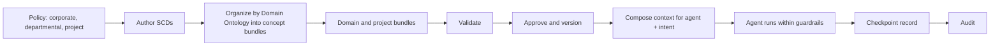
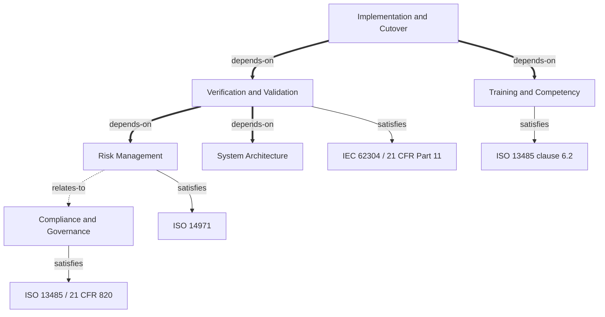

# SCS 0.5.0 — Presentation Story

Working draft. SCS 0.5 is itself still a draft, so the deck should describe the release as in progress.
Each slide has: the **message** (one sentence), what goes **on the slide**, and what the
speaker **says**. Edit here; build slides from it afterward.

Status: Sections 1, 2 and 3 drafted.

---

# Section 1 — Context: What It Is and Why SCS

**Arc:** AI agents behave unpredictably without context -> here is what context is and the two kinds ->
SCS focuses on one of them -> four reasons SCS exists.

## Slide 1.1 — Why AI Agents Behave Unpredictably

**Message:** An agent with no boundaries fills every gap with a plausible guess.

**On the slide**
- Agents are given a task, not the rules of the organization they work for
- Where the rules are missing, the agent guesses
- The guesses are fluent and confident, so they are hard to spot
- Result: drift, invention (hallucination), and inconsistency from one run to the next

**Say**
Ask two agents, or the same agent on two days, to do the same job and the answers can differ. The
model is not misbehaving; it was never told where the edges are. Whatever the prompt does not settle,
the agent settles for itself.

**Illustration (optional):** `docs/quick-start-guide.md` shows a Task model request where the agent
invents assignee, team and attachment fields that are out of scope. It is an illustrative example, not
measured data, so label it that way.

## Slide 1.2 — What Is Context?

**Message:** Context is what keeps an agent inside the lines. It exists mainly for the agent.

**On the slide**
- Context = the limits, conventions and rules an agent works within
- Written for agents first; people benefit too (consistency, review, onboarding)
- Its job: keep the agent from drifting and from making things up

**Say**
We usually think of context as something for the user's convenience. The more useful view is that it
is for the agent. It tells the agent what is allowed, what the house conventions are, and what it must
not do. People benefit as a side effect, because the same rules are visible to them.

## Slide 1.3 — Two Kinds of Context

**Message:** Guardrails and state data behave differently, so they are handled differently.

**On the slide** (table)

| | Guardrails | State data |
|---|---|---|
| What it is | Limits, conventions, rules, policies | Current facts: an order, a balance, a record |
| Applies to | All agents | Depends on the task |
| Changes | Rarely, and deliberately | Constantly |
| Comes from | Company leadership and policy | Systems of record |
| Delivered by | Present every time | Looked up when needed |

**Say**
Guardrails are the decisions an organization has made and expects every agent to honor. They change
slowly and someone is accountable for them. State is the world as it is right now. It changes all the
time, so it cannot be written down once; it has to be looked up.

**Note on terminology:** `spec/0.5/any-ai-actor-model.md` §2.2 uses "context" for guardrails only and
calls the second category "state". The deck calls both "context" with two types. Decide which
wording to use in the deck and keep it consistent with the spec, or note the difference on this slide.

## Slide 1.4 — Guardrails Reflect Policy

**Message:** Guardrails are the organization's policies, expressed for agents.

**On the slide**
- Corporate policy
- Departmental policy
- Project-level rules
- Every agent in scope follows them, whatever task it is doing

**Say**
Guardrails are not invented by the AI team. They restate what leadership, departments and project
owners have already decided. That is why they are stable, and also why they do change from time to
time when a policy changes.

**Note:** the spec's tiers are meta / standards / project. The roadmap describes Corporate / Project
and the mapping is an open item (ISS-012). Keep this slide at the policy level and do not draw the
tier names here.

## Slide 1.5 — SCS Focuses on Guardrail Context

**Message:** SCS governs guardrails. State is fetched at runtime by other means.

**On the slide**
- SCS: guardrail context - stable, authored, versioned, approved
- Not SCS: state data - looked up by tools, APIs and application code
- The two work together: guardrails bound what an agent may do with the state it retrieves

**Say**
The scope is deliberate. State data has a good home already: the tool calls and systems that hold it.
What has been missing is a disciplined way to define, version and audit the guardrails. That is the
gap SCS fills.

## Slide 1.6 — Why SCS? Four Reasons

**Message:** Guardrails need to be small, clear, versioned and governable.

**On the slide**
1. Small - context is sent with every prompt, so size costs money
2. Clear - long-winded context confuses agents
3. Versioned - policies change, so you must know which version an agent used
4. Governable - regulators expect audit trails, provenance and transparency

**Say**
These four reasons are the rest of the section. Each one is a problem you will recognize from
context you have written by hand.

## Slide 1.7 — Small: Context Is Paid For Every Time

**Message:** Guardrails travel with every prompt, so every extra word is repeated cost.

**On the slide**
- Context is sent with every prompt
- Long-winded context gets expensive
- SCS keeps guardrails to the essential aspects: atomic documents, one idea each

**Say**
A rule that is 500 words when 50 would do costs you the extra 450 on every call, for every agent,
indefinitely. SCS is built around concise, atomic, structured documents so that what travels is
what matters.

**To add before presenting:** a real number. Nothing in the repo measures this. If you want a figure,
compare the token count of an existing hand-written CLAUDE.md with the same guidance as compiled SCS
context. Do not quote a percentage until it is measured.

## Slide 1.8 — Clear: One Decision Per Document

**Message:** Long context is confusing, inconclusive, arbitrary and contradictory. Structure is the remedy.

**On the slide**
- Long context tends to be: confusing, inconclusive, arbitrary, contradictory
- SCS: each SCD is one atomic, typed, versioned decision
- Explicit relationships between documents; structure checked by a validator

**Say**
When rules accumulate in a long document, they start to overlap and disagree, and the agent has to
pick one. Structure removes most of that: one decision per document, typed, and linked explicitly to
the others it relates to.

**Accuracy note:** the validator checks structure and references. Detection of redundant or
contradictory content is stated intent but **not yet enforced** (`domain-ontology.md` §6, properties 3
and 4). The slide says structure "reduces" these problems; avoid "stops all of that" unless that
checking ships.

## Slide 1.9 — Versioned: Know What Each Agent Followed

**Message:** Policies change, so context is versioned and you can tell which version governed which agent.

**On the slide**
- Corporate, departmental and project policy each change over time
- SCS bundles are versioned, and approved once released
- Each agent's context can be traced to an exact version at any point in time

**Say**
When an incident review asks "what rules was the agent working under on that day?", the answer should
be a version number and an approver, not a guess.

**Accuracy note:** versioning and approval fields are in the spec today (`version_approved_by`,
`version_approved_at`). The record of which version an agent used is the **checkpoint record**: SCS
defines its shape and schema, but a runtime has to emit it. Say "SCS makes this traceable", and keep
the runtime's part visible if the audience is technical.

## Slide 1.10 — Governable: Audit, Provenance, Transparency

**Message:** Regulated work needs evidence. SCS provides the structure for it.

**On the slide**
- Audit trail: which context governed which step
- Provenance: who authored it, who approved it, when
- Transparency: guardrails are readable by people and by machines
- Regulatory mapping: concepts linked to the standards they satisfy

**Say**
In regulated industries, "the agent followed our policy" is a claim that needs evidence. Authorship,
approval, versions and checkpoints are that evidence. SCS makes the evidence possible to produce.

**Accuracy note:** SCS declares and records. It does not enforce, and it does not verify that content
is correct or sufficient (`any-ai-actor-model.md` §3.4; `domain-ontology.md` §6). Enforcement belongs
to the runtime. "Makes governance possible" is accurate; "provides compliance" is not.

## Slide 1.11 — Bridge to Section 2

**Message:** Next: how SCS structures guardrails.

**On the slide**
- Section 1 recap: context bounds agents; guardrails vs state; SCS = small, clear, versioned, governable
- Next: SCDs, bundles and the Domain Ontology

---

# Open items for Section 1

1. **Terminology:** "two types of context" (this deck) vs "context and state" (spec §2.2). Pick one.
2. **A number for slide 1.7.** Measure tokens or drop the quantitative claim.
3. **A concrete before/after for slide 1.1.** The quick-start Task example is illustrative; a real
   incident from a regulated setting would land better.
4. **Tier naming on slide 1.4** waits on ISS-012.
5. **Softened claims:** "stops all of that" (1.8) and "makes regulatory governance possible" (1.10)
   are written more carefully above because the spec does not yet enforce contradiction checks and
   does not enforce policy. Confirm you are comfortable with the softer wording.

---

# Section 2 — SCS Structure

**Arc:** the workflow (your drawing) -> the components on it -> the Domain Ontology in depth ->
how guardrails reach an agent.

**Tie-back to Section 1:** each piece of structure exists to serve one of the four reasons
(small, clear, versioned, governable). The drawing and the slides keep pointing at that.

## Slide 2.1 — The SCS Workflow  *(your drawing)*

**Message:** SCS carries a policy from written intent to an auditable agent run, in a defined sequence.

**On the slide:** the drawing. Suggested content for it:

1. **Policy** - corporate, departmental and project policy (the source of guardrails)
2. **Author SCDs** - one atomic decision per document
3. **Organize by Domain Ontology** - each SCD belongs to a concept; concepts become concept bundles
4. **Assemble bundles** - concept bundles -> domain bundle -> project bundle
5. **Validate** - structure, references and ontology rules checked
6. **Approve and version** - a named approver and a version number
7. **Compose for the agent** - context selected by (agent, intent) and delivered
8. **Agent runs within the guardrails**
9. **Checkpoint record** - which bundle version governed this step
10. **Audit**

Suggested emphasis in the drawing:
- Make step 3 (the ontology) visually the largest element; it is the emphasis of this section.
- Draw a boundary between what **SCS defines** (steps 1-6, plus the *shape* of the record in step 9)
  and what a **runtime performs** (steps 7-9: composing, running, writing the record). SCS does not
  compose, run or enforce; a runtime such as SCP does.
- Tag steps with the Section 1 reasons: 2 = small, 3 and 5 = clear, 6 = versioned, 9 and 10 = governable.

Reference sketch (for your drawing; renders in any Mermaid viewer):



**Say**
Read the drawing left to right. The left half is authoring and governance: people decide, write, check
and approve. The right half is runtime: an agent receives the right slice of that approved context and
leaves a record of which version it followed. The middle is where the structure earns its keep.

## Slide 2.2 — The Components at a Glance

**Message:** Six components; the ontology is the one that organizes the rest.

**On the slide** (numbered to match callouts on the drawing)

| # | Component | What it is | Serves |
|---|---|---|---|
| 1 | **SCD** | One atomic guardrail: a rule, constraint or decision, in YAML | Small |
| 2 | **Tier** | Meta (vocabulary), Standards (requirements), Project (the system) | Clear |
| 3 | **Bundle** | A versioned manifest that groups SCDs and other bundles | Versioned |
| 4 | **Domain Ontology** | The industry baseline: the concepts (categories) guardrails are organized around, and how they relate | Clear, Governable |
| 5 | **Validator** | Checks structure, references and ontology rules | Clear |
| 6 | **Approval + checkpoint** | Who approved a version; which version governed a step | Versioned, Governable |

**Say**
Five of these are things you would expect: a unit of content, a way to classify it, a way to package it,
a way to check it, a way to sign it off. The fourth is the one that is new in 0.5.0 and the one that
gives the rest a shape.

## Slide 2.3 — The SCD: One Guardrail, One Document

**Message:** The Structured Context Document is the atomic unit.

**On the slide**
- One coherent piece of context per document: a rule, a constraint, a compliance requirement, a decision
- YAML: readable by people, parseable by machines
- Typed, versioned, independently reviewable, linkable to other SCDs
- Names itself: `scd:<tier>:<name>`

```yaml
id: scd:project:hazard-analysis-procedure
type: project
title: Hazard Analysis Procedure
version: "0.5.0"
concept: concept:risk-management
content:
  ...
```
*(from `spec/0.5/domain-ontology.md` §3.3; shows the new optional `concept` field that links an SCD to
the ontology)*

**Say**
Small on purpose. If a document is describing two things, it should be two documents. That is what keeps
context small and what makes each guardrail reviewable and replaceable on its own.

## Slide 2.4 — Three Tiers

**Message:** SCDs fall into three tiers so vocabulary, requirements and the system stay separate.

**On the slide**
- **Meta** - the shared language: roles, capabilities, naming, system-wide intent
- **Standards** - external requirements as importable contracts: HIPAA, SOC2, ISO 13485, IEC 62304
- **Project** - the actual system: architecture, requirements, workflows, policies
- Standards are imported, not rewritten for each project

**Say**
Meta defines the words. Standards holds requirements someone else already wrote. Project holds what is
specific to this system. Keeping them apart means a standard can be updated once and imported many times.

**Note:** ISS-012 (open) will reconcile these names with a Corporate/Project framing. Keep the slide to
the three names and the plain-language purpose until that resolves.

## Slide 2.5 — Bundles and the Hierarchy

**Message:** Bundles package SCDs into a hierarchy: Project > Domain > Concept > SCD.

**On the slide**
- A bundle is a versioned manifest, not an SCD (think Docker manifest)
- **Concept bundle** - the SCDs realizing one concept; a leaf, imports nothing
- **Domain bundle** - imports the concept bundles for an industry or practice area
- **Project bundle** - imports what one initiative needs
- Meta and Standards bundles carry the vocabulary and the requirements

**Say**
This is the packaging that makes context reusable and versionable. A project does not copy the domain's
guardrails; it imports them at a pinned version.

## Slide 2.6 — The Domain Ontology: What Organizes the Guardrails  *(emphasis begins)*

**Message:** A domain needs a shared model of what matters in its work. That model is the ontology.

**On the slide**
- Every domain has a set of things its guardrails are about: risk, validation, suppliers, security...
- 0.3 called this a flat list of "concerns"; it was really one industry's list (software development)
- A medical-device CDMO needed risk management, design controls and supplier qualification, and lost
  the regulatory mapping that matters most in that market
- 0.5.0 makes the model explicit: the **Domain Ontology**, which reflects the industry the customer is in

**Say**
The question a regulated team actually asks is "does our context cover this clause of this standard?"
A flat list of headings cannot answer that. A model of concepts, how they relate, and which standards
they address can.

## Slide 2.7 — The Ontology Has Three Parts

**Message:** Concepts, an optional taxonomy, and a small fixed set of relationships.

**On the slide**
1. **Concepts** - named categories of domain knowledge (`concept:risk-management`). Replaces "concerns"
2. **Taxonomy** - optional parent and child (`concept:iso-14971-risk-analysis` under risk management)
3. **Relationships** - `depends-on`, `relates-to`, `satisfies`
- `satisfies` links a concept to the standards it exists to address
- Depth is optional: the smallest valid ontology is a flat list of concepts
- Not OWL, not RDF, no reasoner: a typed graph you can read

**Say**
Start with a flat list and add structure as the domain matures. The relationship set is deliberately
small: three edge types, so anyone can read and review it.

**Note:** taxonomy (`parent`) does not appear in any shipped example. The only sample is the spec's
illustrative snippet (`domain-ontology.md` §3.1). If the slide shows a taxonomy, source it from there
and label it illustrative.

## Slide 2.8 — Three Ontologies for Three Industries

**Message:** The ontology reflects the industry the customer is in.

**On the slide**

| Industry | Ontology | Concepts | What is distinctive |
|---|---|---|---|
| Software development | **SDLC** | 11 | Architecture, security, testing and validation, deployment and operations |
| Medical-device CDMO | **CDMO** | 12 | Risk management, verification and validation, supplier qualification, QMS records; concepts mapped to regulatory standards |
| Merchant cash advance (business funding) | **MCA** | 16 | Origination, underwriting and decisioning, contract characterization, disclosure compliance, servicing and collections |

- Same job in every industry: define the categories of guardrail that matter
- Different categories, because different industries have different things to get right
- Adoption starts by choosing the ontology for your industry, not by writing one

**Say**
A software company and a lender do not worry about the same things. Trying to run both through one
list of headings loses what matters most in each. So SCS has one ontology per industry. Each is a
baseline: the categories an organization in that industry needs guardrails for.

**Teaching detail:** the same word can mean different things by industry. In MCA "security" natively
means the lien on receivables, so the MCA ontology names its access-control concept `data-security`
instead. Good evidence for why one shared list does not work.

**Status notes (not for the slide):**
- **SCS 0.5 is still a draft**, and **MCA ships with the 0.5 release** (decided by Tim). Present all
  three ontologies as part of 0.5, and say the release is in progress if presenting before the tag.
- All three manifests are in this repo (`schema/domain/examples/`): `software-development-domain.yaml`,
  `medical-device-cdmo-domain.yaml` and `merchant-cash-advance-domain.yaml` (ISS-039; validates clean,
  16 concepts, 15 relationships, no `satisfies`). It comes from a working draft in the engagement repo
  (`everest/docs/ontology.md`, `status: draft`, 2026-09-23), so recheck the concept list if that
  document changes before release. The spec text now describes three models (`rfcs/RFC-0001` is left as
  the accepted record). The engagement's 16 skeleton SCDs were deliberately not shipped.
- MCA was derived from a client engagement. Confirm the client is comfortable with it being published
  in an open-source repo, and with any wording that could identify them. Slide 2.8 uses no client or
  people names.

## Slide 2.9 — Ontology, Concepts, SCDs: Who Owns What

**Message:** The ontology sets the baseline. Concepts are the categories. SCDs hold the details.

**On the slide** (a three-layer drawing works well here)

| Layer | What it is | Scope |
|---|---|---|
| **Ontology** | The industry's baseline: which categories matter, and how they relate | Shared by every customer in the industry |
| **Concepts** | The categories themselves: `risk-management`, `underwriting-decisioning`, ... Each is realized as a concept bundle | Part of the baseline |
| **SCDs** | The details: the customer's actual rules, thresholds and policies | Written by the customer |

- Example (CDMO): ontology -> concept `risk-management` -> SCD `hazard-analysis-procedure`
- Inside an ontology some concepts are industry-native and some are the AI-governance layer every
  industry needs (for example `ai-accountability`, `training-competency`, `data-provenance` appear in both CDMO and MCA)

**Say**
The ontology does not contain anyone's policy. It contains the shape that policy fits into. The
customer's rules live in the SCDs, filed under the concepts. That split is what lets an industry share
a baseline while every company keeps its own details.

**Note:** the SCD example is real (`domain-ontology.md` §3.3). The MCA skeleton SCDs are placeholders
with no content, so they are not used as examples here.

## Slide 2.10 — The Baseline: Customers Add, They Don't Subtract

**Message:** The ontology is the floor. A customer builds on it and does not remove from it.

**On the slide**
- Customers **may add**: their own concepts, SCDs, relationships and standards mappings
- Customers **may not remove** concepts from the industry baseline
- Why it matters: everyone in an industry is measured against the same categories, so a gap shows up
  instead of being quietly dropped, and "covered" means the same thing across customers

**Say**
The baseline is a promise to anyone relying on it: an auditor, a partner, the customer's own leadership.
If a category can be deleted, the absence of guardrails on it looks the same as never having needed
them.

**Status notes (not for the slide) - this rule is not in the spec or the validator today:**
- The spec says adoption means choosing a model, "using an existing one if it fits, or adapting the
  nearest one" (`domain-ontology.md` §4), and that a manifest "declares which concepts it uses". The
  CDMO ontology itself was derived from SDLC by keeping, renaming, adding and leaving out concepts.
  So the current text permits subtraction, and nothing checks for it.
- Enforcing it needs a model to be a referenceable, versioned artifact a manifest points to. That is
  the open "Ontology Model packaging" question (`domain-ontology.md` §10).
- Open design points if this becomes normative: does a rename count as subtraction; can a customer
  mark a concept "not applicable" with a recorded rationale and approval (a concept that genuinely
  does not apply is a real case); how a baseline update reaches customers on an older version.
- Suggested next step: record it as a backlog item (and likely a small RFC, since it changes what a
  conformant domain manifest may do). Until then, present it as the intended model and not as a
  checked rule.

## Slide 2.11 — The Ontology in a Real Domain: Medical-Device CDMO

**Message:** In the CDMO domain the ontology shows how the work connects and what each concept must satisfy.

**On the slide:** a simplified graph (draw it, or use the sketch). All edges below are from
`schema/domain/examples/medical-device-cdmo-domain.yaml`; the full domain has 12 concepts and this shows 5.



**On the slide (callouts)**
- Validation depends on risk management and system architecture
- Cutover cannot happen until validation and training are done
- Each concept lists the clauses it exists to address

**Say**
These edges came from how CDMO work actually connects. Cutover waits on validation and training.
Validation rests on risk and architecture. Each concept points at the regulation behind it.

**Caveat for the slide footer:** the CDMO domain is a generic reference scaffold. The standards mappings
are illustrative, have not been reviewed by a regulatory owner, and should not be read as compliance
guidance.

## Slide 2.12 — What the Ontology Lets You Ask

**Message:** Because the model is data, questions about coverage become lookups, not reading exercises.

**On the slide**
- Which concepts address ISO 14971?  -> the concepts whose `satisfies` lists it
- What must be in place before validation?  -> follow its `depends-on` edges
- Which standards does risk management answer to?  -> its `satisfies` list
- Does every SCD belong to a real concept?  -> checked by the validator

**Say**
The point is the direction of travel. Instead of a person reading a policy binder to check coverage, the
relationships are declared once and can be queried and checked.

**Accuracy note:** today the edges are declared and validated for well-formedness. A dedicated coverage
report (`scs coverage --framework iso-13485`) and ontology-aware context selection are listed under
Future Extensions in `domain-ontology.md` §11, **not shipped**. Present these as what the structure
makes possible, and say what runs today (the validator).

## Slide 2.13 — The Ontology Is Checked, Not Just Documented

**Message:** The validator enforces the structure, so the model stays consistent.

**On the slide**
- IDs are well-formed and unique
- Parents and `depends-on` chains have no cycles
- Every relationship target exists
- Every SCD's concept is a real concept in the domain
- Leftover 0.3 "concern" usage is an error with a migration hint
- `scs-validate --domain <manifest>`

**Say**
Eight rules, all mechanical. They make the ontology trustworthy enough to build on. What the validator
does not do is judge whether the content is true or sufficient.

## Slide 2.14 — Approved, Not Just Authored

**Message:** A released bundle records who approved it and when.

**On the slide**
- Authorship is always recorded
- Once a bundle has a real version (not DRAFT), `version_approved_by` and `version_approved_at` are required
- One accountable approver per bundle version today; per-perspective attestation is on the backlog

**Say**
This is what turns "someone wrote it" into "someone with standing signed off on version 1.2.0". It is
the provenance half of the governance story from Section 1.

## Slide 2.15 — How Guardrails Reach an Agent

**Message:** The ontology also decides which guardrails an agent receives.

**On the slide**
- Context is selected by **(agent, intent)**: which role is acting, doing what task
- Intent is scoped to concepts in the domain ontology
- The pair resolves to a set of concept bundles, not the whole corpus
- A checkpoint record then notes the exact bundle version that governed the step
- SCS defines the content and the record format; a runtime does the composing

**Say**
This closes the loop with Section 1. An agent handling a risk-management task receives the risk
guardrails, not every guardrail. That keeps context small and makes it possible to say afterward which
version applied.

**Note:** the selection key and the checkpoint record are specified (`any-ai-actor-model.md` §2.3, §4).
Walking `depends-on` edges to pull in related concepts automatically is a future extension.

## Slide 2.16 — Bridge to Section 3

**On the slide**
- Recap: SCDs -> tiers -> bundles -> **ontology** -> validation -> approval -> agent
- Next: how to use it

---

# Open items for Section 2

1. **MCA release work.** Done: manifest, tests, spec text and a release-checklist entry (ISS-039).
   Recheck slide 2.8's concept count if the source ontology changes.
2. **Client clearance.** MCA was derived from a client engagement and will be published in an
   open-source repo. Confirm with the client before release; slide 2.8 uses no client or people names.
3. **"Add, don't subtract" (slide 2.10) is not specified or enforced.** Needs a decision, probably an
   RFC, and depends on Ontology Model packaging. Also decide how rename and "not applicable" are treated.
4. **Drawing boundary.** Decide how to show SCS vs runtime (steps 7-9 in slide 2.1) so the audience
   does not read SCS as an enforcement engine.
5. **Taxonomy has no real example.** Add a `parent` relationship to the CDMO example, or label the
   spec snippet illustrative.
6. **CDMO mappings are generic.** Standards mappings (for example IEC 62304 against verification and
   validation) are scaffold choices, not reviewed. Keep the caveat on 2.11.
7. **Future-vs-shipped wording** on 2.12 and 2.15 (coverage report, ontology-aware selection).
8. **Tier names** on 2.4 wait on ISS-012.
9. **How much of "any AI actor" belongs here** vs a later section. 2.15 gives it one slide; policy-as-
   context is not covered yet.
10. **Slide count.** Section 2 is now 16 slides; 2.3 to 2.5 could merge if it feels long.

---

---

# Section 3 — How to Use SCS 0.5.0

**Arc:** the same workflow as the Section 2 drawing, now as things you do: pick an ontology ->
scaffold -> author -> validate -> approve and version -> deliver to agents -> record and audit.

**How this section was checked.** On 2026-09-24 both tools were installed from the `0.5-dev` checkout
into a clean venv and the workflow was run end to end, then re-run after the tooling fixes (ISS-026 to
ISS-028, ISS-032 to ISS-034, all done the same day and covered by the regression suites in
`tools/*/tests`). Commands below are marked **verified** or **not run** (the Claude Code plugins).
ISS-035 (the `scs-validator` wheel could not run) is also fixed: a non-editable install works from a
clean venv. ISS-029 is partly done: the scaffold now generates a Domain Ontology manifest. Still open and
relevant here: **ISS-029's** `--ontology` selector for CDMO/MCA and **ISS-030** (stale docs). Nothing has been published to PyPI yet (ISS-014).

## Slide 3.1 — The Path

**Message:** Using SCS is the workflow you saw, done in order.

**On the slide**
1. Choose the ontology for your industry
2. Scaffold a project
3. Author SCDs under the concepts
4. Validate
5. Approve and version
6. Deliver to agents
7. Record checkpoints and audit

**Say**
Each step produces something reviewable and lives in git. You can stop after any step and have something
useful: a validated set of guardrails is already better than a hand-maintained instruction file.

## Slide 3.2 — Three Ways In

**Message:** Pick the entry point that matches how you work; all of them produce plain YAML in git.

**On the slide**

| | Who it is for | What it does |
|---|---|---|
| **Claude Code plugins** | Solo developers (`scs-vibe`), teams (`scs-team`) | Conversational setup; writes `CLAUDE.md` and `.claude/rules/` |
| **CLI** | Anyone scripting or working in a repo | `scs` scaffolds and versions; `scs-validate` validates |
| **By hand** | Spec authors, domain experts | Copy an example, edit YAML |

- Two console scripts by design: `scs` (scaffolding, from `scs-tools`) and `scs-validate` (from `scs-validator`)

**Say**
The plugins are the lowest-friction start. The CLI is what you use to make the process repeatable and
to gate changes. Both write the same files.

**Status:** plugin skills (`scs-vibe`: `init`, `explain`, `validate`; `scs-team`: `init`, `add`, `draft`,
`use`, `status`, `validate`, `version`) are described from their `SKILL.md` files and were **not run**.

## Slide 3.3 — Step 1: Choose Your Industry Ontology

**Message:** Start by choosing the ontology that matches your industry, not by writing one.

**On the slide**
- **SDLC** - software development
- **CDMO** - medical-device contract manufacturing
- **MCA** - merchant cash advance / business funding
- The ontology is the baseline; you add your own concepts and SCDs on top
- A domain manifest carries the ontology in its `ontology` block

**Say**
This is the decision that shapes everything after it, and it is a business decision more than a technical
one. The baseline gives you the categories an organization in your industry is expected to cover.

**Status:**
- SDLC, CDMO and MCA manifests are all in `schema/domain/examples/` (MCA: ISS-039).
- "Add but do not remove" is the intended model; it is not enforced (see slide 2.10 notes).
- `scs new project` generates `domain/domain-manifest.yaml`, a flat SDLC Domain Ontology of the concepts it
  created (verified; ISS-029). It scaffolds only the SDLC shape: **open ISS-029** is a `--ontology` selector
  for CDMO and MCA, which needs scaffold templates for them.

## Slide 3.4 — Step 2: Scaffold a Project

**Message:** One command creates the structure; everything starts as DRAFT.

**On the slide**
```bash
pip install scs-tools
scs new project my-app --type healthcare
```
- Creates 11 concept bundles, a domain bundle, project, meta and standards bundles, and a Domain Ontology manifest (`domain/domain-manifest.yaml`)
- About 40 SCD templates in `context/project/`, each with placeholder text to replace
- Project types: healthcare, fintech, saas, government, standard, minimal
- All bundles start at `version: DRAFT`, so no approval is required yet

**Say**
The templates are prompts for the decisions you need to make, not finished content. A template such as
the threat model literally reads `"[STRIDE|PASTA|Attack Trees|etc]"` until someone decides.

**Status:** **verified** for all six project types (2026-09-24; healthcare gives 11 concept bundles and
39 SCD templates, all of which now validate: ISS-032; minimal generates 3 concept bundles and the domain
bundle imports only those: ISS-033). `pip install scs-tools` from PyPI is **not available yet**
(ISS-014: nothing is published); installing the built wheels works (ISS-035 fixed), so demo from source or from wheels. `.scs/config`
records `scs_version: 0.1.0`.

## Slide 3.5 — Step 3: Author SCDs

**Message:** Write one decision per SCD, file it under a concept, and record who wrote it.

**On the slide**
- Edit the templates in `context/project/`; add more with `scs add scd <name>` or `scs add bundle <name>`
- Keep each SCD atomic; describe the environment, not the implementation
- Set `concept: concept:<id>` so the SCD sits under the ontology
- Record provenance: who created it, when, why
- With Claude Code: `scs-team add` turns an existing document into draft SCDs; `scs-team draft`
  interviews you when nothing is written down

**Say**
This is where the customer's own policies go in. It is also where a human has to stay in charge: generated
SCDs are drafts for review. Nothing here should be accepted without a person reading it.

**Status:** `scs add scd` and `scs add bundle <concept>` **verified** (ISS-034 fixed a broken
`add bundle`); the plugin skills **not run**.

## Slide 3.6 — Step 4: Bring in Standards

**Message:** Import the requirements that apply and link concepts to them.

**On the slide**
- Standards live in a standards bundle as SCDs, imported rather than rewritten
- `scs-team use hipaa | soc2 | pci | chai | gdpr` copies pre-built standards into the project
- In the ontology, `satisfies` links a concept to the standards SCDs it addresses
- The repo includes a CHAI prior authorization standards bundle

**Say**
Importing a standard puts the requirement into governed context. It is not a claim of compliance.

**Status:** plugin standards library exists (`plugins/scs-team/standards/`: chai, gdpr, hipaa, pci, soc2);
the skill was **not run**.

## Slide 3.7 — Step 5: Validate

**Message:** Four kinds of artifact can be validated, each with one command.

**On the slide**
```bash
scs-validate context/project/threat-model.yaml            # an SCD
scs-validate --bundle bundles/project-bundle.yaml         # a bundle
scs-validate --domain domain/domain-manifest.yaml         # a Domain Ontology
scs-validate --checkpoint checkpoint.yaml                 # a checkpoint record
```
- `--strict` fails on warnings (exit 2); `--output json` for tooling
- Exit codes: 0 valid, 1 errors, 2 warnings in strict mode, 3 bad arguments, 4 file error, 5 internal

**Say**
Validation is what makes the guardrails trustworthy enough to version. It checks structure, references and
the ontology rules. It does not judge whether the content is right.

**Status:** all four **verified** from a source checkout with no flags (the schema directory is now
discovered: ISS-028; `--schema-dir` or `SCS_SCHEMA_DIR` overrides). `--strict` exit code 2 verified.
`scs validate ...` (the scs-tools command) now takes the same options as `scs-validate` (ISS-026), so
either can be used on the slide. Both also work from a non-editable wheel install (ISS-035).

## Slide 3.8 — Reading the Results

**Message:** Errors block; warnings tell you what to look at.

**On the slide** (real output, 2026-09-24)

| Input | Result |
|---|---|
| CDMO domain manifest | Valid: 0 errors, 9 warnings |
| Software-development manifest | Valid: 0 errors, 0 warnings |
| Checkpoint record, complete | Valid |
| Checkpoint record missing `intent` and `timestamp`, bad bundle id | 3 errors |
| 0.3-style manifest with `concerns:` | Errors, with a message naming the replacement |

- The 9 CDMO warnings are `satisfies` targets that cannot be resolved without the standards SCDs loaded:
  the check is designed to warn, not fail, at manifest level

**Say**
Failing on the old `concerns` field is deliberate. The message tells you what to replace it with, which is
the migration path in one line.

**Status:** all **verified** 2026-09-24 and pinned by `tools/scd-validator/tests/test_regression_050.py`.
Note the legacy-`concerns` message points to `docs/MIGRATION-0.5.0.md`, which does not exist yet
(ISS-016; noted in ISS-030).

## Slide 3.9 — Step 6: Approve and Version

**Message:** Versioning freezes a bundle and records who approved it.

**On the slide**
```bash
scs bundle version --bundle bundles/concepts/security.yaml \
  --version 0.1.0 --approved-by sam@example.com --notes "First approved cut"
```
- Writes a versioned snapshot and a `VERSION-<v>-MANIFEST.yaml` with a SHA-256 checksum
- Records `version_approved_by` and `version_approved_at` in the bundle's provenance
- Optionally commits and tags in git (`v0.1.0`)
- Imports then pin exact versions

**Say**
This is the step that turns "someone wrote it" into "someone with standing approved version 0.1.0". Git
gives you review and history; the checksum and approval fields give you evidence.

**Status:** **verified** 2026-09-24 in a real git repository, with validation on: validation passes,
the snapshot and `VERSION-0.1.0-MANIFEST.yaml` are written, the snapshot says `version: 0.1.0` and
carries the approval fields (ISS-027 fixed), and git commits and tags `v0.1.0`. Versioning a concept
bundle is the safe demo; imports in a versioned project or domain bundle still need to be pinned by hand.

## Slide 3.10 — Step 7: Deliver to Agents

**Message:** SCS defines the guardrails; something else composes them for a specific agent.

**On the slide**
- Claude Code: `scs-vibe init` and `scs-team` write `CLAUDE.md` and `.claude/rules/`
- Other runtimes: a composer reads governed SCS content and produces what that consumer needs
  (an MCP permission gate, a per-step prompt in an orchestrator)
- Selection key: **(agent, intent)**, scoped to concepts, so an agent receives the relevant concept
  bundles and not everything
- SCS does not compose, run or enforce; a runtime does (for example SCP, a separate product)

**Say**
This is the hand-off point. Getting guardrails to an agent is deliberately outside the spec, so that the
same governed content can serve whichever tools you use.

**Status:** plugin output **not run**. Selection by (agent, intent) is specified
(`any-ai-actor-model.md` §2.3); walking `depends-on` edges to pull in related concepts is a future
extension.

## Slide 3.11 — Step 8: Record and Audit

**Message:** Each governed step leaves a small record of which context applied.

**On the slide**
```yaml
checkpoint:
  bundle: bundle:risk-management:1.2.0
  concept: concept:risk-management
  agent: role:quality-engineer
  intent: hazard-analysis-review
  timestamp: "2026-09-23T10:00:00Z"
  workflow_ref: "workflow:release-review/run-4821/step-3"
```
- Required: `bundle` (exact version), `agent`, `intent`, `timestamp`
- Generated by the runtime, not authored; checked with `scs-validate --checkpoint`
- Answers: which version of which guardrails governed step 3 of run 4821?

**Say**
This is the audit half of the story from Section 1. The record is small on purpose. SCS defines its shape;
the runtime writes it.

**Status:** schema validation **verified** (valid record passes; an incomplete one fails with three errors).
Emitting and storing records is the runtime's job and is not part of this repo.

## Slide 3.12 — Worked Example: A Guardrail from Policy to Audit

**Message:** One policy, followed through every step.

**On the slide**
1. **Policy:** quality engineers may read the risk register; writing needs approval
2. **SCD:** a Policy SCD under `concept:risk-management` (`permitted_operations`: `fetch-data` allowed,
   `write-data` requires approval)
3. **Validate:** `scs-validate` passes it as an ordinary project-tier SCD
4. **Approve and version:** bundle released at a version with a named approver
5. **Deliver:** a runtime compiles the policy into whatever its tool gateway needs
6. **Record:** each governed step writes a checkpoint naming the bundle version

**Say**
The policy is written once, in one place. The gateway rule, the version, the approver and the audit record
all trace back to it.

**Status:** the Policy SCD example validates as a normal project-tier SCD (verified by ISS-006 testing;
`project-tier.md` §5.7). The roles and resource names are illustrative.

## Slide 3.13 — Migrating from 0.3

**Message:** A guided rename, then optional depth.

**On the slide**
1. `type: concern` -> `type: concept`; `concerns/` -> `concepts/`
2. Domain manifest: replace `concerns:` with an `ontology` block (a flat list is valid)
3. Add `concept:` to SCDs in concept bundles
4. Add `version_approved_by` / `version_approved_at` to non-DRAFT bundles
5. Run the 0.5.0 validator and fix any `concern` residue
6. Add taxonomy, relationships and `satisfies` when ready

**Say**
There is no automated migration helper planned for 0.5.0. The validator names what to change, and the
steps are mechanical.

**Status:** steps from `domain-ontology.md` §9. The standalone guide `docs/MIGRATION-0.5.0.md` is **not
written yet** (ISS-016). The validator error for `concerns` is **verified**.

## Slide 3.14 — Where the Release Stands

**Message:** 0.5.0 is in progress; here is what is done and what is left.

**On the slide**
- **Done:** Domain Ontology (schema, validator, spec, examples, tools, plugins); "any AI actor" model
  (agent + intent, policy-as-context, checkpoint records)
- **In progress:** runtime decisions (immutability scope, version selection, context drift); model-routing
  metadata; CI and published releases; migration guide and release notes; MCA ontology

**Say**
Be direct about it: the specification and validator for the ontology are in place, and the surrounding
tooling and documentation are being brought up to match before the tag.

**Note:** Phases 3 to 9 in `RELEASE-0.5.0.md` are still open as of this draft, and the open tooling items are ISS-029 (selector only), ISS-030, ISS-031 and ISS-038; recheck before presenting.

## Slide 3.15 — Get Involved

**On the slide**
- Repository: github.com/tim-mccrimmon/structured-context-spec
- Specification: `spec/0.5/` (start with `overview.md` and `domain-ontology.md`); design rationale in RFC-0001
- Try it: validate `schema/domain/examples/medical-device-cdmo-domain.yaml`
- Feedback: GitHub Issues and Discussions; new industry ontologies from domain experts

**Note:** check that structuredcontext.dev and the docs site are not still showing 0.3 content (ISS-023, ISS-030).

---

# Demo script (verified 2026-09-24, re-run after the tooling fixes)

Run from a source checkout (`pip install -e tools/scd-validator -e tools/cli` in a venv) or from built
wheels (`pip wheel --no-deps -w dist ./tools/scd-validator ./tools/cli && pip install dist/*.whl`); both
were verified. No `--schema-dir` is needed (the schema directory is discovered). Replace `$R` with the
repo root.

```bash
# 1. Scaffold
scs new project my-app --type healthcare --author "Your Name" --email you@example.com --no-interactive
cd my-app

# 2. Validate an SCD, the project bundle, and (three equivalent ways) the bundle
scs-validate context/project/threat-model.yaml
scs-validate --bundle bundles/project-bundle.yaml
scs bundle validate

# 3. Validate the ontology: 0 errors, 9 expected warnings; then strict mode (exit 2)
scs validate --domain $R/schema/domain/examples/medical-device-cdmo-domain.yaml
scs validate --domain $R/schema/domain/examples/medical-device-cdmo-domain.yaml --strict

# 4. Failures worth showing: a 0.3-style manifest with `concerns:`; an incomplete checkpoint record
scs validate --domain old-domain.yaml
scs validate --checkpoint cp-bad.yaml

# 5. Approve and version (needs a git repo: git init && git add -A && git commit -m init)
scs bundle version --bundle bundles/concepts/security.yaml --version 0.1.0 \
  --approved-by sam@example.com --notes "First approved cut"
git tag          # v0.1.0
```

All five steps run cleanly.

---

# Open items for Section 3

1. **Nothing is published to PyPI yet (ISS-014).** Slides 3.4 and 3.7 show `pip install scs-tools`;
   either publish first or say "from source" / "from the release wheels".
2. **Scaffold ontology selector (rest of ISS-029).** A new project now gets an SDLC ontology manifest;
   choosing CDMO or MCA at scaffold time is not possible yet. Say so on slide 3.3, or decide whether
   it is needed for 0.5.0. Related: ISS-038 (scaffolded SCDs do not yet declare their `concept`).
3. **Plugins were not run.** If the plugin flow is the recommended path, run `/scs-vibe:init` and
   `/scs-team:init` once and capture real output for slides 3.2 and 3.10.
4. **MCA** is in the repo but cannot be chosen from the CLI yet (rest of ISS-029); slide 3.3 should say so.
5. **Slide 3.14** must be re-checked against `RELEASE-0.5.0.md` and `ISSUES.md` right before presenting.
6. The tooling fixes are committed on `0.5-dev` but not released or tagged.

---

# Companion file

`scs-0.5.0-slides.md` is the clean presentation deck (slide content and speaker notes) generated from this
working file. Edit here for status, accuracy notes and open items; regenerate or update the slides file to match.
